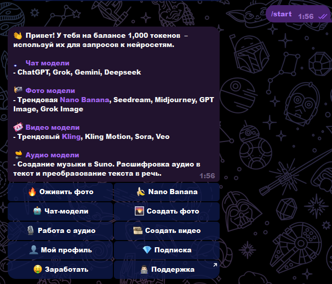
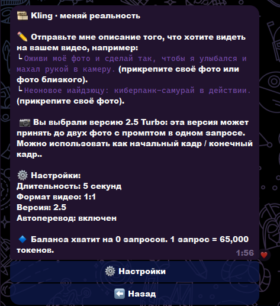
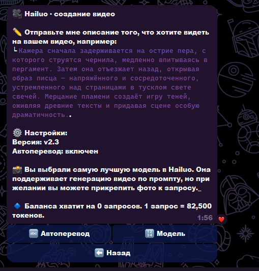
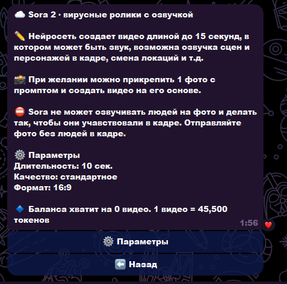
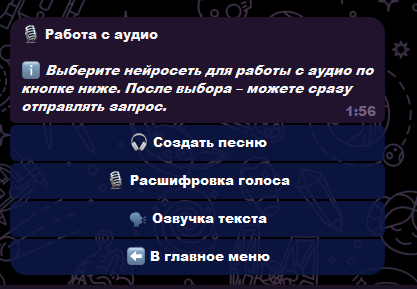
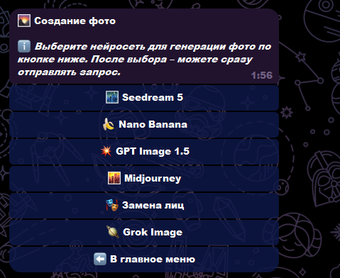
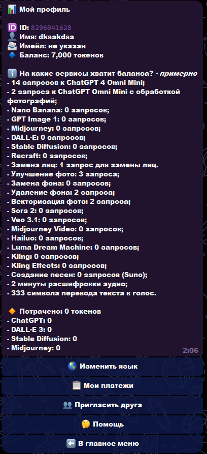

# Telegram Multi AI Bot — мульти‑ИИ в Telegram

> [!IMPORTANT]
> **Публикация:** витрина для портфолио — описание, стек и скриншоты интерфейса. Ключи API, токены бота, платежные секреты и дампы базы **в репозиторий не выкладываются** (см. `.gitignore`). Полная инструкция для разработки перенесена в [`docs/ORIGINAL_README.md`](docs/ORIGINAL_README.md).

## 💡 Кратко

Telegram‑бот с **балансом токенов** и доступом к **разным нейросетям**: чат‑модели, генерация и обработка изображений, видео, аудио (музыка, расшифровка, озвучка), профиль и подписка.

Интерфейс — сценарии через **кнопки и вложения** (промпты, фото для image/video, настройки моделей).

## ✅ Что реализовано

- Единая точка входа: стартовое меню с разделами (чат, фото, видео, аудио, профиль, подписка и др.).
- **Чат‑модели:** ChatGPT, Grok, Gemini, Deepseek (и сценарии выбора внутри бота).
- **Фото:** несколько движков (в т.ч. Seedream, Nano Banana, GPT Image, Midjourney, замена лиц, Grok Image) — выбор модели и запрос из Telegram.
- **Видео:** линейка генераторов (в т.ч. **Kling**, **Hailuo**, **Sora 2** и др.) с параметрами (длительность, формат, версия, автоперевод промпта где применимо).
- **Аудио:** создание треков, расшифровка голоса, озвучка текста.
- **Профиль:** баланс токенов, оценка «на сколько запросов хватит» по разным сервисам, платежи/рефералы/помощь (по сценариям бота).
- **Backend:** API и хранение данных; интеграции с внешними провайдерами ИИ и платежами (детали — только в приватной конфигурации).

## 🧰 Технологии

| Категория | Стек |
|-----------|------|
| Язык | Python 3.11+ |
| Telegram | Aiogram 3 |
| API | FastAPI |
| Данные | PostgreSQL, SQLAlchemy, Alembic |
| Очереди / кэш | Redis |
| Запуск | Docker Compose (бот + API + БД + Redis) |

Подробные шаги развёртывания — в [`docs/ORIGINAL_README.md`](docs/ORIGINAL_README.md).

## 🖼️ Скриншоты интерфейса

Все изображения — в каталоге [`docs/screenshots/`](docs/screenshots/) (один столбец, удобно читать с телефона).

| # | Экран |
|---|--------|
| 1 | Старт: приветствие, баланс токенов, сетка разделов |
| 2 | Видео: **Kling** — промпт, версия, формат, автоперевод |
| 3 | Видео: **Hailuo** — промпт, версия, фото к запросу |
| 4 | Видео: **Sora 2** — параметры, ограничения по фото с людьми |
| 5 | **Работа с аудио** — выбор сценария |
| 6 | **Создание фото** — выбор модели |
| 7 | **Профиль** — баланс и «на сколько запросов хватит» по сервисам |

## Исходный код

> [!NOTE]
> Публичная витрина может содержать только материалы портфолио. Исходники и конфигурация продакшена передаются заказчику отдельно; по запросу для работодателя возможен **ограниченный показ** фрагментов или обсуждение архитектуры без раскрытия секретов.

## Лицензия

> [!CAUTION]
> Описание и скриншоты — для портфолио. Копирование и использование кода/ключей третьими лицами **не предполагается** без отдельного разрешения.
