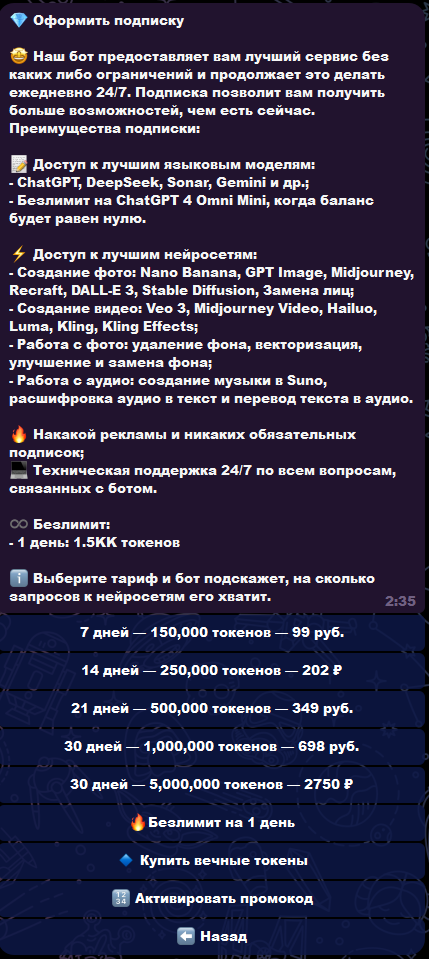
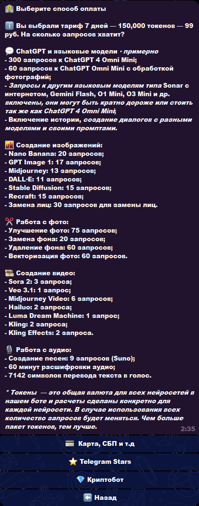

# Telegram Multi AI Bot — мульти‑ИИ в Telegram

> [!IMPORTANT]
> **Публикация:** в репозитории только **описание кейса и скриншоты** для портфолио. **Исходный код не выкладывается** (коммерческий проект). Ключи API, токены бота, платежи и конфигурация остаются у заказчика / в приватном окружении.

## 💡 Кратко

Это **коммерческий Telegram‑продукт**: не точечная интеграция с одной моделью, а **единая точка входа** к нескольким классам нейросетей — **диалог, изображение, видео, аудио** — с **учётом расхода в токенах**, профилем пользователя и сценариями **монетизации и удержания** (подписка, оплата, рефералы, помощь — в рамках задумки заказчика). Пользователь остаётся в привычном мессенджере; внешние API и ключи спрятаны за серверной логикой.

**Оплата и подписка:** в боте реализован **магазин подписок** (тарифы по сроку и объёму токенов, описание преимуществ). Принимаются **ЮKassa** (карта, **СБП** и др.), **Telegram Stars** и криптоплатежи через **CryptoBot** ([@CryptoBot](https://t.me/CryptoBot)).

**Интерфейс** выстроен как **пошаговые сценарии**: сетка разделов, уточняющие кнопки, текстовые промпты и **вложения** (в т.ч. референсы для image/video), выбор модели и параметров там, где это требуют провайдеры — длительность, формат, версия, автоперевод промпта, ограничения по контенту. Цель — снизить когнитивную нагрузку: не «зайди на сайт X и скопируй ключ», а **законченный UX внутри чата**.

**По охвату моделей** бот агрегирует **несколько чат‑движков** (ChatGPT, Grok, Gemini, Deepseek и др.), **линейку фото** (Seedream, Nano Banana, GPT Image, Midjourney, замена лиц, Grok Image и подключаемые варианты), **видеогенераторы** (Kling, Hailuo, Sora 2 и др. с разными правилами API) и **аудио** (генерация, расшифровка, озвучка). В профиле — **баланс** и понятная пользователю **оценка «на сколько запросов хватит»** по разным направлениям, а не только абстрактное число.

**Технически** за ботом стоит связка **отдельного HTTP API**, **PostgreSQL** (состояние, биллинг, миграции Alembic), **Redis** (кэш и фоновые задачи), асинхронная работа с внешними AI и платёжными сервисами; развёртывание — **Docker Compose** (бот + API + БД + Redis). Это уровень **продакшн‑архитектуры**, а не однофайлового скрипта.

В этом репозитории — **описание и скриншоты** для портфолио: по ним видно **глубину продукта и сценариев**. Исходный код и конфигурация **не публикуются**; обсуждение архитектуры или ограниченный показ — **по договорённости** с заказчиком и в интересах NDA.

---

## ✅ Что реализовано

- Единая точка входа: стартовое меню с разделами (чат, фото, видео, аудио, профиль, подписка и др.).
- **Чат‑модели:** ChatGPT, Grok, Gemini, Deepseek (и сценарии выбора внутри бота).
- **Фото:** несколько движков (в т.ч. Seedream, Nano Banana, GPT Image, Midjourney, замена лиц, Grok Image) — выбор модели и запрос из Telegram.
- **Видео:** линейка генераторов (в т.ч. **Kling**, **Hailuo**, **Sora 2** и др.) с параметрами (длительность, формат, версия, автоперевод промпта где применимо).
- **Аудио:** создание треков, расшифровка голоса, озвучка текста.
- **Профиль:** баланс токенов, оценка «на сколько запросов хватит» по разным сервисам, платежи/рефералы/помощь (по сценариям бота).
- **Подписка / магазин:** экран оформления подписки с тарифами и перечнем возможностей; после выбора тарифа — выбор способа оплаты (**ЮKassa**, **Telegram Stars**, **CryptoBot** для криптовалюты).
- **Backend:** API и хранение данных; интеграции с внешними провайдерами ИИ и платежами (детали — только в приватной конфигурации).

## 🧰 Технологии

| Категория | Стек |
|-----------|------|
| Язык | Python 3.11+ |
| Telegram | Aiogram 3 |
| API | FastAPI |
| Данные | PostgreSQL, SQLAlchemy, Alembic |
| Очереди / кэш | Redis |
| Запуск | Docker Compose (бот + API + БД + Redis) |
| Платежи | ЮKassa (карта, СБП и др.), Telegram Stars, CryptoBot ([@CryptoBot](https://t.me/CryptoBot)) |

## 🖼️ Скриншоты интерфейса

Все изображения — в каталоге [`docs/screenshots/`](docs/screenshots/) (один столбец, удобно читать с телефона).

| # | Экран |
|---|--------|
| 1 | Старт: приветствие, баланс токенов, сетка разделов |
| 2 | Видео: **Kling** — промпт, версия, формат, автоперевод |
| 3 | Видео: **Hailuo** — промпт, версия, фото к запросу |
| 4 | Видео: **Sora 2** — параметры, ограничения по фото с людьми |
| 5 | **Работа с аудио** — выбор сценария |
| 6 | **Создание фото** — выбор модели |
| 7 | **Профиль** — баланс и «на сколько запросов хватит» по сервисам |
| 8 | **Подписка / магазин** — тарифы, токены, преимущества подписки |
| 9 | **Способ оплаты** — после выбора тарифа: ЮKassa, Telegram Stars, CryptoBot |

Экран **магазина** (`08-shop.png`): оформление подписки — срок, объём токенов, цена в рублях, перечень моделей и опций (чат, картинки, видео, аудио, без рекламы и т.д.), кнопки тарифов и доп. действий (безлимит на день, вечные токены, промокод). Экран **оплаты** (`09-payment-methods.png`): выбранный тариф, расшифровка «на сколько запросов хватит» по направлениям, кнопки **«Карта, СБП и т.д.»** (ЮKassa), **Telegram Stars**, **CryptoBot**.

## Исходный код

> [!NOTE]
> Исходный код в публичный доступ не передаётся. По запросу для работодателя возможен **ограниченный показ** фрагментов или обсуждение архитектуры (без нарушения интересов заказчика).

## Лицензия

> [!CAUTION]
> Описание и скриншоты — для портфолио. Права на исходный код у заказчика в рамках договора; копирование и использование кода третьими лицами из этого репозитория **не предполагаются** (кода здесь нет).
